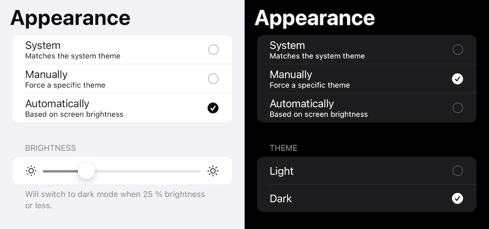
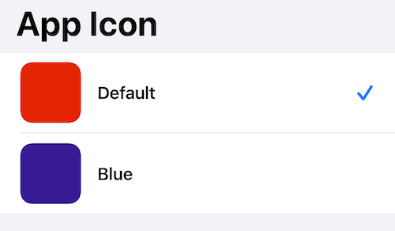

# Settings

Provides a simple generic settings controller with some default app setting sections.

## Features

- Fully customizable
- Easily localizable
- Provides useful default settings

Supports: iOS, macOS (partially)

## Usage

### Sheet

```swift
.sheet(isPresented: $showSettings) {
    SettingsView(showSettings: $showSettings) {
        // Customize your Settings here
        // Add Sections / Rows here e.g.
        Settings.AppearanceView()
        Settings.SupportView()
        Settings.ResetView()
    }
}
```

### Standalone View

```swift
SettingsView {
    // Customize your Settings here
    // Add Sections / Rows here e.g.
    Settings.AppearanceView()
    Settings.SupportView()
    Settings.ResetView()
}
```

See the Demo Project to see some reference implementations.

## Provided Settings

### Appearance

Easily provide a setting within the app to switch between light and dark mode. Options are system, manually or screen brightness based.

Usage: Add the view to the `SettingsView.content`

```swift
Settings.AdvancedAppearanceView()
```

or add this for a simplified version

```swift
Settings.AppearanceView()
```



### Passcode

Protect your app with a passcode. Supports biometrics.

Usage: Add the view to the `SettingsView.content`

```swift
Settings.PasscodeView()
```

### Support

Let users send a support mail via `MFMailComposeViewController`

Usage: Add the view to the `SettingsView.content`

```swift
Settings.SupportView()
```

### Info

Display info from the Info.plist file.

Usage: Add the view to the `SettingsView.content`

```swift
Settings.InfoView()
```

### Device

Display some device informations.

Usage: Add the view to the `SettingsView.content`

```swift
Settings.DeviceView()
```

### Reset

Delete all user defaults to reset the app. Implement the callback for custom reset actions.

Usage: Add the view to the `SettingsView.content`

```swift
Settings.ResetView {
    // Custom app reset logic
}
```

### App Icon

Easily change the App Icon of your app

```swift
Settings.AlternativeIconView(icons: AlternativeAppIcon.allCases)
```

Where `AlternativeAppIcon` is an enum conforming to `AlternateIcon`

```swift
enum AlternativeAppIcon: String, AlternateIcon {
    static var `default`: Self { get }
    
    var alternateIconName: String? { get }
    var preview: Image { get }
    
    var title: String { get }
    var subtitle: String? { get }
}
```



### UserDefaults Browser

Browse your apps UserDefaults. Good for debugging.

Usage: Add the view anywhere in your app.

```swift
UserDefaultsView()
```

### LicensePlist

Read a LicensePlist file generated by [LicensePlist](https://github.com/mono0926/LicensePlist) to display it in app

```swift
let licensePlist = try LicensePlist(filename: "com.mono0926.LicensePlist") // optional url to the location of your Settings.bundle
Settings.LicensePlistView(data: licensePlist)
```

## Localization

To specify your own Strings or provide a different language simply copy `Settings.strings` from Resources to your app and customize the values.

## License

See [LICENSE](LICENSE)

Copyright © 2020 David Walter \(www.davidwalter.at)
